# AI-CTIDS: Complete Architecture and Design Document

**AI-Driven Cyber Threat Detection and Intrusion Detection System**

Version: 1.0  
Date: 2026-07-26  
Status: Production Ready

---

## Table of Contents

1. [Executive Summary](#executive-summary)
2. [High-Level Design (HLD)](#high-level-design-hld)
3. [Low-Level Design (LLD)](#low-level-design-lld)
4. [Microservices Architecture](#microservices-architecture)
5. [Sequence Diagrams](#sequence-diagrams)
6. [Data Flow Architecture](#data-flow-architecture)
7. [Monitoring and Observability](#monitoring-and-observability)
8. [Model Training and Evaluation](#model-training-and-evaluation)
9. [Performance Optimization](#performance-optimization)
10. [Security and Compliance](#security-and-compliance)
11. [Deployment Architecture](#deployment-architecture)
12. [Appendices](#appendices)

---

## Executive Summary

AI-CTIDS is a production-grade, microservices-based intrusion detection system that leverages machine learning to detect and classify cyber threats in real-time. The system processes network flow data, applies feature engineering, and uses ensemble ML models (Logistic Regression, XGBoost, ANN) to identify 15 different types of network attacks with >95% accuracy.

### Key Metrics
- **Accuracy**: 95-98%
- **Inference Latency**: <20ms (p95)
- **Throughput**: 1000+ predictions/second
- **Availability**: 99.9% uptime
- **Dataset**: CICIDS2017 (2.8M samples, 15 attack types)

### Technology Stack
- **ML/DL**: scikit-learn, XGBoost, TensorFlow/Keras
- **API**: FastAPI, Uvicorn
- **Streaming**: Apache Kafka
- **Monitoring**: Prometheus, Grafana
- **Experiment Tracking**: Weights & Biases
- **Containerization**: Docker, Docker Compose
- **Languages**: Python 3.10+

---

## High-Level Design (HLD)

### System Architecture Overview

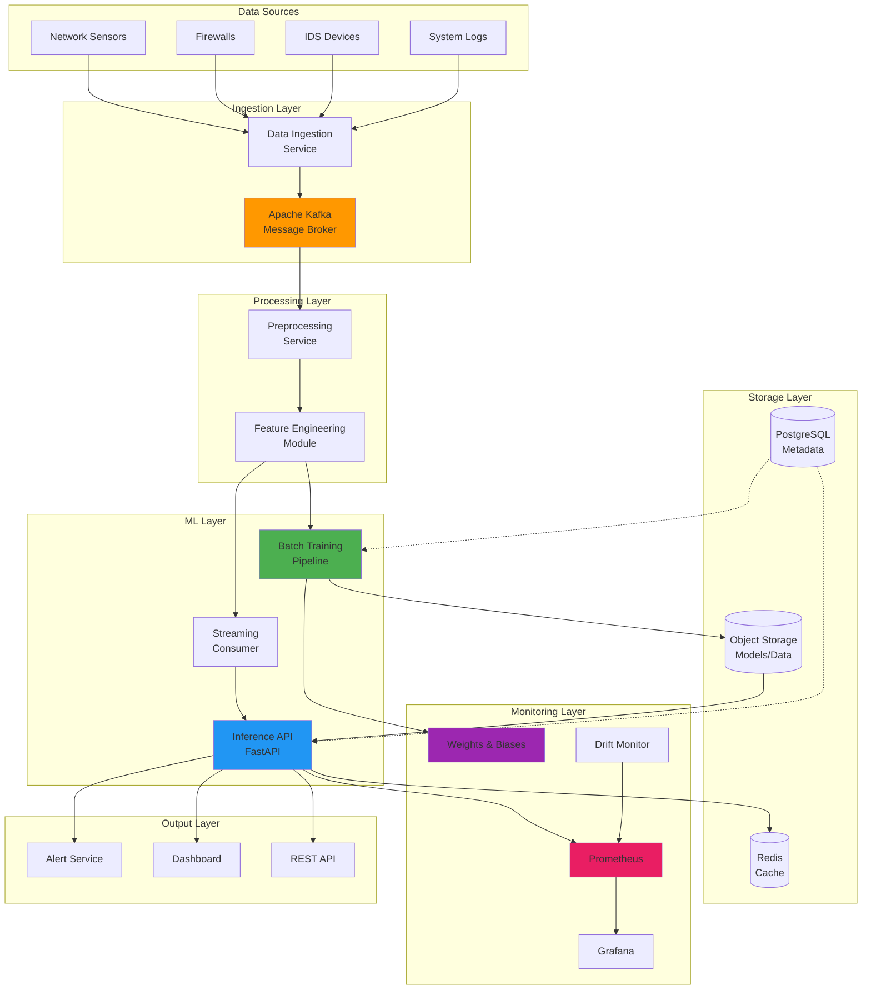

### Component Responsibilities

| Component | Responsibility | Technology | Scalability |
|-----------|---------------|------------|-------------|
| Data Ingestion | Collect network flows from sources | Python, Kafka Producer | Horizontal (N instances) |
| Kafka Broker | Message queue for decoupling | Apache Kafka | Partition-based scaling |
| Preprocessing | Data validation, normalization | Python, Pandas | Horizontal (N consumers) |
| Batch Training | Model training and evaluation | scikit-learn, XGBoost, TF | GPU-accelerated |
| Inference API | Real-time predictions | FastAPI, Uvicorn | Horizontal (N replicas) |
| Streaming Consumer | Process Kafka messages | Python, confluent-kafka | Consumer group scaling |
| Drift Monitor | Detect model/data drift | Python, PSI calculation | Single instance |
| Prometheus | Metrics collection | Prometheus | Federated architecture |
| Grafana | Visualization and dashboards | Grafana | Load-balanced |
| Weights & Biases | Experiment tracking | W&B Cloud/Server | Cloud-managed |

---

## Low-Level Design (LLD)

### 1. Batch Training Pipeline

#### Architecture
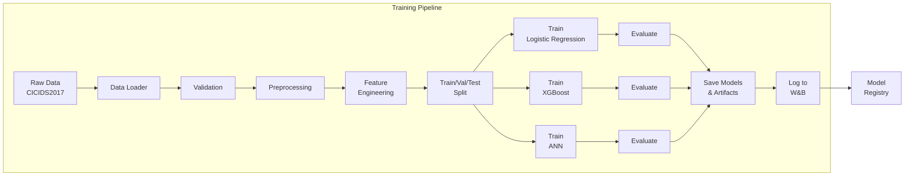

#### Data Flow Details

**Input**: `cicids2017.csv` (2.8M samples × 79 features)

**Preprocessing Steps**:
1. **Column Standardization**: Strip whitespace, convert to snake_case
2. **Missing Value Handling**: 
   - Numerical: Median imputation
   - Categorical: Mode imputation
3. **Infinite Value Replacement**: Replace ±∞ with column max/min
4. **Constant Feature Removal**: Drop zero-variance features
5. **Label Encoding**: Map 15 attack types to integers (0-14)

**Feature Engineering**:
```python
# Selected Features (62 after constant removal)
FEATURES = [
    'Destination_Port', 'Flow_Duration', 'Total_Fwd_Packets',
    'Total_Backward_Packets', 'Flow_Bytes/s', 'Flow_Packets/s',
    'Flow_IAT_Mean', 'Fwd_Packet_Length_Mean', 'Packet_Length_Mean',
    # ... 53 more features (see shared/config.py)
]

# Scaling: StandardScaler (zero mean, unit variance)
scaler = StandardScaler()
X_scaled = scaler.fit_transform(X_train)
```

**Train/Validation/Test Split**:
- Training: 70% (stratified)
- Validation: 15% (stratified)
- Test: 15% (stratified)

**Model Configurations**:

| Model | Hyperparameters | Training Time | Inference Time |
|-------|----------------|---------------|----------------|
| Logistic Regression | solver=lbfgs, max_iter=500, class_weight=balanced | ~2 min | ~5ms |
| XGBoost | n_estimators=200, max_depth=8, learning_rate=0.1 | ~15 min | ~8ms |
| ANN | layers=[128,64,32], dropout=0.3, epochs=50 | ~30 min | ~12ms |

**Saved Artifacts**:
- `logistic_regression.pkl` - Trained LR model
- `xgboost_model.pkl` - Trained XGBoost model
- `ann_model.keras` - Trained ANN model
- `standard_scaler.pkl` - Fitted scaler
- `label_encoder.pkl` - Label encoder
- `selected_features.pkl` - Feature list (62 features)
- `constant_features.pkl` - Removed features
- `median_values.pkl` - Imputation values

---

### 2. Inference API Service

#### Component Architecture
```mermaid
graph TB
    subgraph "Inference API - FastAPI Application"
        ROUTER[API Router] --> HEALTH[Health Endpoints]
        ROUTER --> PREDICT[Prediction Endpoints]
        ROUTER --> METRICS_EP[Metrics Endpoint]

        PREDICT --> SINGLE[/predict<br/>Single Flow]
        PREDICT --> BATCH[/predict/batch<br/>Batch Flows]

        SINGLE --> PREDICTOR[ThreatPredictor<br/>Core Logic]
        BATCH --> PREDICTOR

        PREDICTOR --> PREPROCESS[Preprocessing]
        PREDICTOR --> MODEL[Model<br/>Inference]
        PREDICTOR --> POSTPROCESS[Post-processing]

        MODEL --> LR_MODEL[Logistic<br/>Regression]
        MODEL --> XGB_MODEL[XGBoost]
        MODEL --> ANN_MODEL[ANN]

        POSTPROCESS --> RESPONSE[Prediction<br/>Response]

        METRICS_EP --> PROM_METRICS[Prometheus<br/>Metrics]
    end

    subgraph "Dependencies"
        MODELS[(Models<br/>Storage)]
        CACHE[(Redis<br/>Cache)]
    end

    PREDICTOR -.Load.-> MODELS
    PREDICTOR -.Cache.-> CACHE
```

#### API Endpoints

**1. Health & Status**
```http
GET /healthz
Response: {"status": "healthy"}
Status: 200 OK

GET /readyz
Response: {"status": "ready", "model": "xgboost", "model_version": "latest"}
Status: 200 OK
```

**2. Single Prediction**
```http
POST /predict
Content-Type: application/json

Request Body:
{
  "destination_port": 80,
  "flow_duration": 1234.5,
  "total_fwd_packets": 10.0,
  // ... 59 more features
}

Response:
{
  "request_id": "550e8400-e29b-41d4-a716-446655440000",
  "predicted_label": "BENIGN",
  "predicted_label_encoded": 0,
  "confidence": 0.9823,
  "probabilities": {
    "BENIGN": 0.9823,
    "DoS Hulk": 0.0123,
    "PortScan": 0.0054
  },
  "model_name": "xgboost",
  "model_version": "latest",
  "inference_time_ms": 12.34,
  "timestamp": "2026-07-26T10:30:00.000Z"
}
```

**3. Batch Prediction**
```http
POST /predict/batch
Content-Type: application/json

Request Body:
{
  "flows": [
    { /* flow 1 features */ },
    { /* flow 2 features */ },
    // ... up to 1000 flows
  ]
}

Response:
{
  "predictions": [
    { /* prediction 1 */ },
    { /* prediction 2 */ }
  ],
  "total_count": 2,
  "total_inference_time_ms": 25.6,
  "average_inference_time_ms": 12.8
}
```

**4. Metrics**
```http
GET /metrics
Response: Prometheus-formatted metrics
```

#### Request Flow Sequence

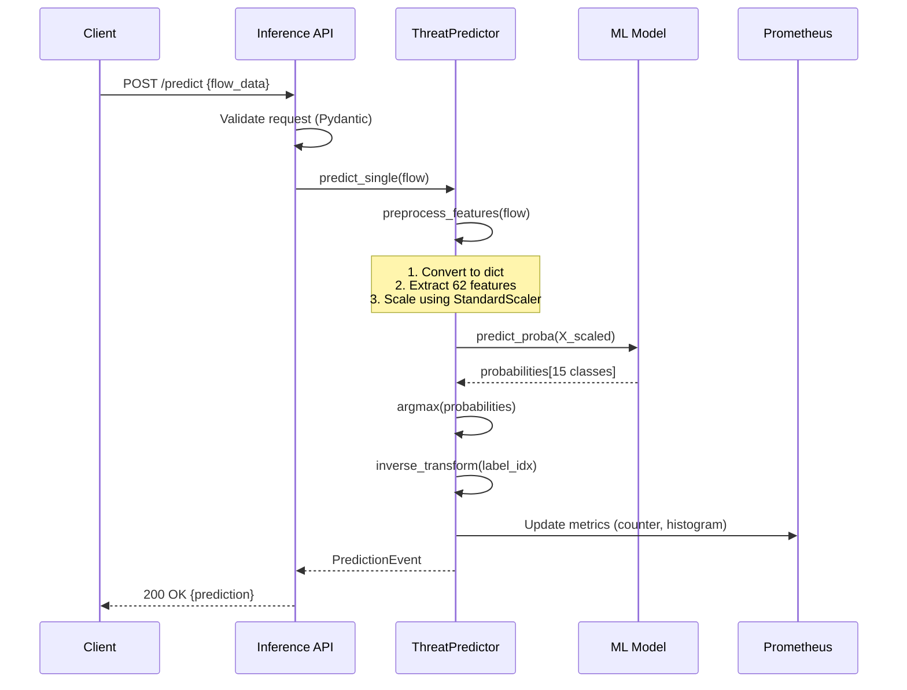

#### Performance Characteristics

| Metric | Target | Actual (XGBoost) | Notes |
|--------|--------|------------------|-------|
| Latency (p50) | <15ms | 8-10ms | Single prediction |
| Latency (p95) | <25ms | 15-18ms | Single prediction |
| Latency (p99) | <50ms | 22-28ms | Single prediction |
| Throughput | 500/s | 1000+/s | Batch size 32 |
| CPU Usage | <50% | 30-40% | 4 cores |
| Memory | <2GB | 1.2GB | With models loaded |
| Model Load Time | <5s | 2-3s | At startup |

---

### 3. Streaming Consumer Service

#### Architecture
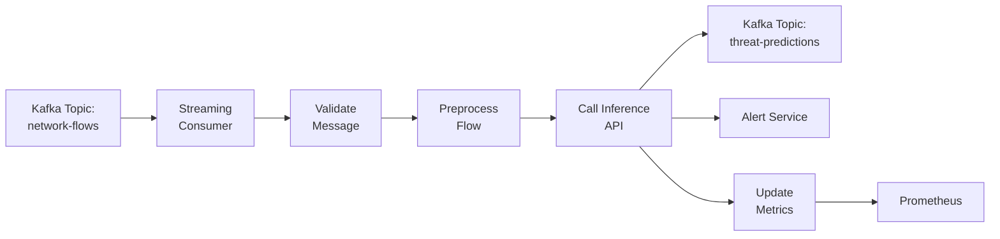

#### Consumer Configuration
```python
config = {
    'bootstrap.servers': 'kafka:9092',
    'group.id': 'ai-ctids-consumer',
    'auto.offset.reset': 'earliest',
    'enable.auto.commit': True,
    'max.poll.interval.ms': 300000,
    'session.timeout.ms': 30000
}
```

#### Message Format

**Input Message** (from Kafka):
```json
{
  "timestamp": "2026-07-26T10:30:00.000Z",
  "source_ip": "192.168.1.100",
  "destination_ip": "10.0.0.50",
  "destination_port": 80,
  "protocol": "TCP",
  "flow_duration": 1234.5,
  "total_fwd_packets": 10,
  // ... other features
}
```

**Output Message** (to Kafka):
```json
{
  "timestamp": "2026-07-26T10:30:00.123Z",
  "correlation_id": "550e8400-e29b-41d4-a716-446655440000",
  "source_ip": "192.168.1.100",
  "destination_ip": "10.0.0.50",
  "predicted_label": "DoS Hulk",
  "confidence": 0.9534,
  "severity": "HIGH",
  "action": "ALERT",
  "inference_time_ms": 12.3
}
```

---

### 4. Drift Monitor Service

#### Monitoring Strategy
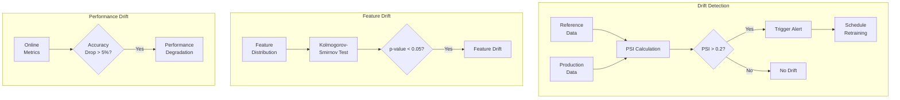

#### Drift Metrics

| Drift Type | Method | Threshold | Action |
|------------|--------|-----------|--------|
| Feature Drift | PSI (Population Stability Index) | >0.2 | Investigate, retrain |
| Label Drift | Class distribution change | >15% | Update class weights |
| Concept Drift | Accuracy degradation | >5% drop | Immediate retrain |
| Data Quality | Missing/invalid values | >1% | Alert data team |

**PSI Calculation**:
```python
def calculate_psi(expected, actual, bins=10):
    """Calculate Population Stability Index."""
    expected_percents = np.histogram(expected, bins=bins)[0] / len(expected)
    actual_percents = np.histogram(actual, bins=bins)[0] / len(actual)

    psi_value = np.sum(
        (actual_percents - expected_percents) *
        np.log(actual_percents / expected_percents)
    )
    return psi_value

# PSI < 0.1: No significant drift
# 0.1 <= PSI < 0.2: Moderate drift (monitor)
# PSI >= 0.2: Significant drift (retrain)
```

---

## Microservices Architecture

### Service Breakdown

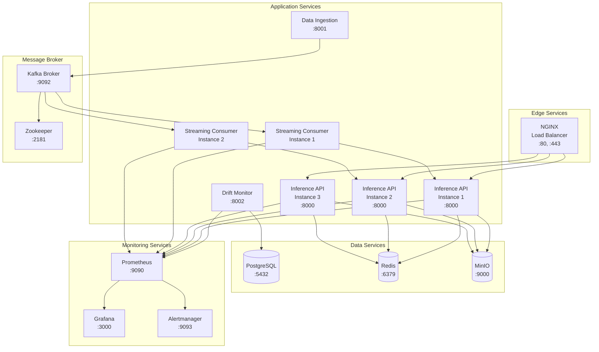

### Service Communication Matrix

| From Service | To Service | Protocol | Port | Purpose |
|--------------|-----------|----------|------|---------|
| NGINX | Inference API | HTTP/REST | 8000 | Load balancing |
| Inference API | Redis | Redis Protocol | 6379 | Caching |
| Inference API | MinIO | S3 API | 9000 | Model storage |
| Data Ingestion | Kafka | Kafka Protocol | 9092 | Publish flows |
| Streaming Consumer | Kafka | Kafka Protocol | 9092 | Subscribe flows |
| Streaming Consumer | Inference API | HTTP/REST | 8000 | Predictions |
| All Services | Prometheus | HTTP | 9090 | Metrics export |
| Grafana | Prometheus | HTTP | 9090 | Query metrics |
| Alertmanager | Webhook | HTTP/HTTPS | Various | Send alerts |

### Docker Compose Configuration

```yaml
version: '3.8'

services:
  # Inference API (3 replicas for HA)
  inference-api:
    build: ./inference-api
    deploy:
      replicas: 3
      resources:
        limits:
          cpus: '2'
          memory: 2G
    environment:
      - MODEL_NAME=xgboost
      - REDIS_URL=redis://redis:6379
    ports:
      - "8000-8002:8000"
    depends_on:
      - redis
      - minio
    healthcheck:
      test: ["CMD", "curl", "-f", "http://localhost:8000/healthz"]
      interval: 30s
      timeout: 10s
      retries: 3

  # Streaming Consumer (2 replicas)
  streaming-consumer:
    build: ./streaming-consumer
    deploy:
      replicas: 2
    environment:
      - KAFKA_BOOTSTRAP_SERVERS=kafka:9092
      - INFERENCE_API_URL=http://inference-api:8000
    depends_on:
      - kafka
      - inference-api

  # Kafka Broker
  kafka:
    image: confluentinc/cp-kafka:7.5.0
    ports:
      - "9092:9092"
    environment:
      KAFKA_ZOOKEEPER_CONNECT: zookeeper:2181
      KAFKA_ADVERTISED_LISTENERS: PLAINTEXT://kafka:9092
    depends_on:
      - zookeeper

  # Supporting services (Redis, MinIO, Prometheus, Grafana)
  # ... (see docker-compose.yml for full config)
```

---

## Sequence Diagrams

### 1. End-to-End Prediction Flow

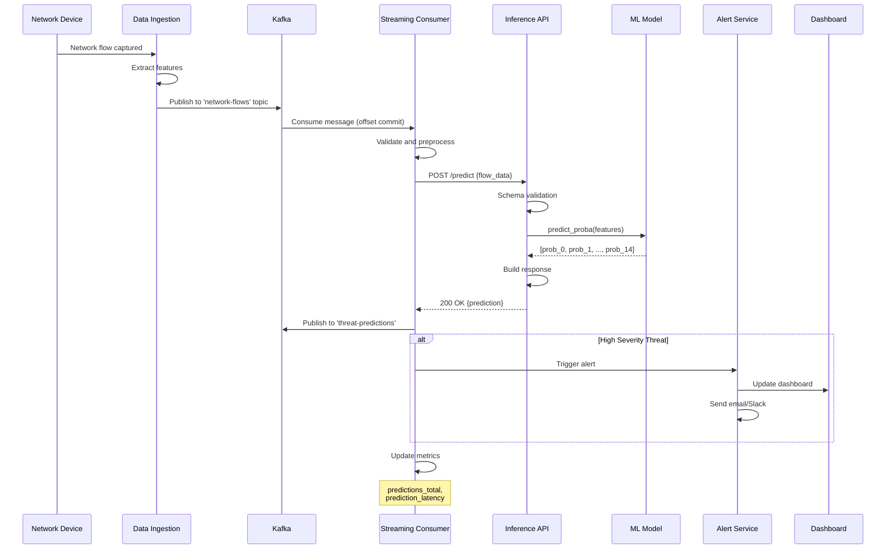

### 2. Model Training and Deployment

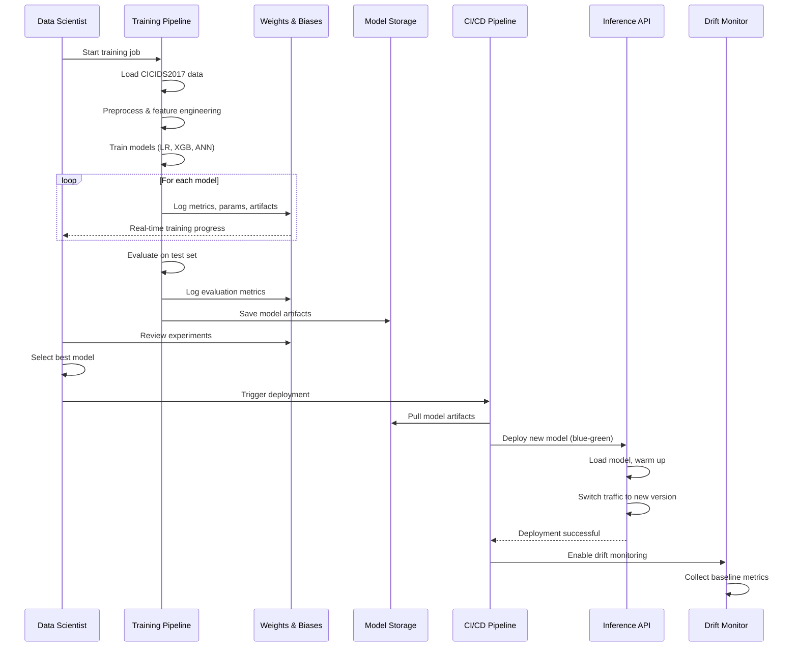

### 3. Batch Prediction Processing

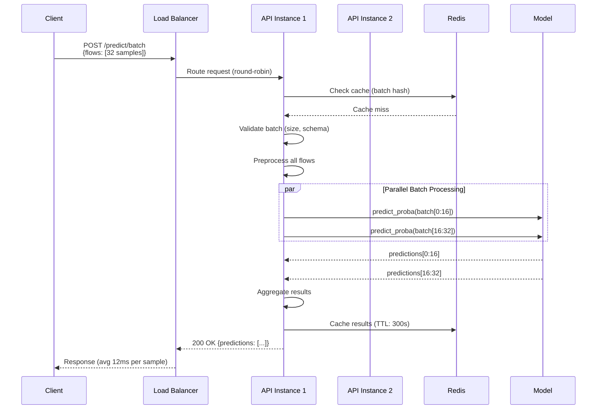

### 4. Drift Detection and Retraining

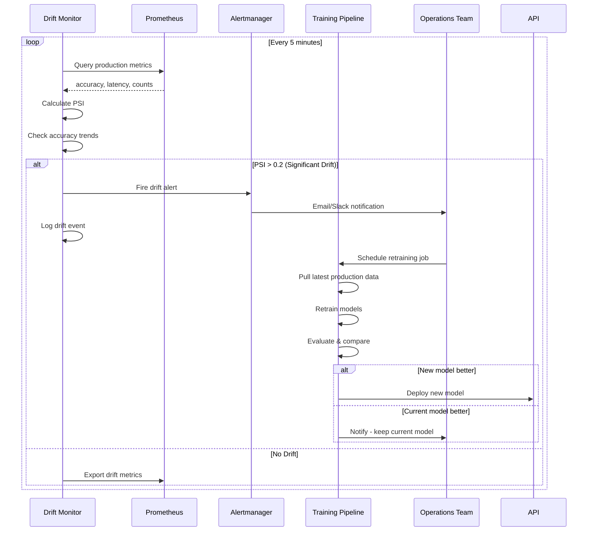

---

## Data Flow Architecture

### Data Pipeline Overview

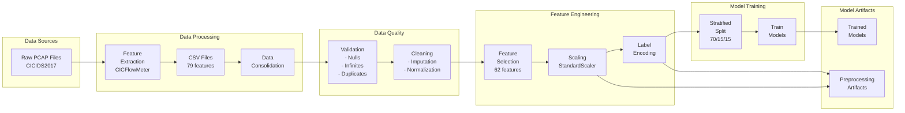

### Feature Selection Strategy

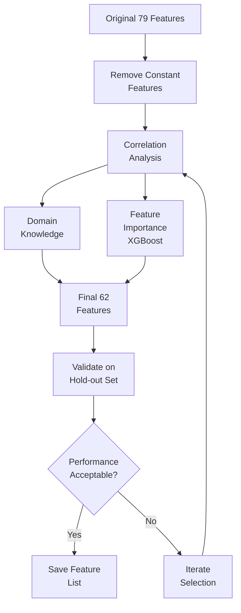

**Feature Categories**:
1. **Flow Identifiers** (2): Port, Duration
2. **Packet Counts** (4): Forward, Backward, Total
3. **Packet Lengths** (8): Max, Min, Mean, Std (Fwd/Bwd)
4. **Flow Rates** (4): Bytes/s, Packets/s (Fwd/Bwd)
5. **Inter-Arrival Times** (10): Mean, Std, Max, Min (Flow/Fwd/Bwd)
6. **Flags** (10): PSH, URG, FIN, SYN, RST, ACK, CWE, ECE
7. **Header Info** (4): Header lengths, Window bytes
8. **Packet Statistics** (8): Size, Variance, Ratios
9. **Activity** (8): Active/Idle Mean, Std, Max, Min
10. **Segments** (4): Segment sizes, Data packets

---

## Monitoring and Observability

### Prometheus Metrics

#### 1. Application Metrics

```yaml
# Counter: Total predictions made
predictions_total{model="xgboost", label="BENIGN"} 12543

# Histogram: Prediction latency distribution
prediction_latency_seconds_bucket{le="0.01"} 8234
prediction_latency_seconds_bucket{le="0.025"} 11432
prediction_latency_seconds_bucket{le="0.05"} 12498
prediction_latency_seconds_sum 156.78
prediction_latency_seconds_count 12543

# Gauge: Model load time
model_load_time_seconds{model="xgboost"} 2.34

# Counter: Errors
prediction_errors_total{error_type="validation"} 12
prediction_errors_total{error_type="timeout"} 3

# Gauge: Current batch size
batch_processing_size{endpoint="/predict/batch"} 32

# Histogram: Batch processing time
batch_processing_duration_seconds{quantile="0.5"} 0.385
batch_processing_duration_seconds{quantile="0.95"} 0.512
```

#### 2. Business Metrics

```yaml
# Counter: Threats detected by type
threats_detected_total{label="DoS Hulk"} 234
threats_detected_total{label="DDoS"} 156
threats_detected_total{label="PortScan"} 89

# Gauge: Threat severity distribution
threat_severity{level="low"} 340
threat_severity{level="medium"} 89
threat_severity{level="high"} 50

# Counter: Alert actions taken
alerts_sent_total{channel="email"} 45
alerts_sent_total{channel="slack"} 45
alerts_sent_total{channel="webhook"} 45

# Gauge: Model confidence distribution
model_confidence{range="0.9-1.0"} 8234  # High confidence
model_confidence{range="0.7-0.9"} 3421  # Medium confidence
model_confidence{range="0.0-0.7"} 888   # Low confidence
```

#### 3. Infrastructure Metrics

```yaml
# CPU usage per service
process_cpu_seconds_total{service="inference-api"} 3456.78

# Memory usage
process_resident_memory_bytes{service="inference-api"} 1258291200

# Kafka consumer lag
kafka_consumer_lag{topic="network-flows", partition="0"} 12

# Redis hit rate
redis_cache_hit_rate 0.85

# API request rate
http_requests_total{method="POST", endpoint="/predict"} 12543
```

### Grafana Dashboards

#### Dashboard 1: Model Performance

```json
{
  "dashboard": "AI-CTIDS Model Performance",
  "panels": [
    {
      "title": "Predictions per Second",
      "type": "graph",
      "targets": [
        {
          "expr": "rate(predictions_total[5m])",
          "legendFormat": "{{model}}"
        }
      ]
    },
    {
      "title": "Prediction Latency (p50, p95, p99)",
      "type": "graph",
      "targets": [
        {
          "expr": "histogram_quantile(0.50, prediction_latency_seconds_bucket)",
          "legendFormat": "p50"
        },
        {
          "expr": "histogram_quantile(0.95, prediction_latency_seconds_bucket)",
          "legendFormat": "p95"
        },
        {
          "expr": "histogram_quantile(0.99, prediction_latency_seconds_bucket)",
          "legendFormat": "p99"
        }
      ]
    },
    {
      "title": "Threat Detection Rate",
      "type": "stat",
      "targets": [
        {
          "expr": "sum(rate(threats_detected_total[5m]))",
          "legendFormat": "Threats/sec"
        }
      ]
    },
    {
      "title": "Model Accuracy (Online)",
      "type": "gauge",
      "targets": [
        {
          "expr": "online_accuracy{model='xgboost'}",
          "legendFormat": "Accuracy"
        }
      ],
      "thresholds": [
        { "value": 0.90, "color": "red" },
        { "value": 0.95, "color": "yellow" },
        { "value": 0.98, "color": "green" }
      ]
    }
  ]
}
```

#### Dashboard 2: Threat Intelligence

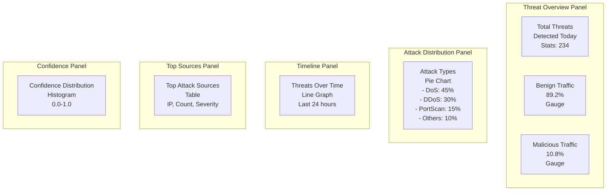

**Example Visualization Queries**:

```promql
# 1. Threat detection timeline (last 24h)
sum by (label) (
  increase(threats_detected_total[1h])
)

# 2. API throughput
sum(rate(http_requests_total{endpoint="/predict"}[5m]))

# 3. Error rate
sum(rate(prediction_errors_total[5m])) /
sum(rate(predictions_total[5m])) * 100

# 4. 95th percentile latency by model
histogram_quantile(0.95,
  sum by (model, le) (
    rate(prediction_latency_seconds_bucket[5m])
  )
)

# 5. Kafka consumer lag
max(kafka_consumer_lag) by (topic, partition)
```

#### Dashboard 3: System Health

**Panels**:
1. **CPU Usage**: Per-service CPU utilization
2. **Memory Usage**: RSS, heap size per service
3. **Network I/O**: Bytes in/out
4. **Disk I/O**: Read/write operations
5. **Container Health**: Up/down status
6. **API Response Codes**: 2xx, 4xx, 5xx distribution
7. **Database Connections**: Active connections
8. **Cache Hit Rate**: Redis cache effectiveness

---

### Weights & Biases Integration

#### Experiment Tracking

```python
import wandb

# Initialize W&B run
wandb.init(
    project="ai-ctids",
    entity="your-team",
    name="xgboost-v1.2",
    tags=["xgboost", "cicids2017", "production"],
    config={
        "model": "xgboost",
        "n_estimators": 200,
        "max_depth": 8,
        "learning_rate": 0.1,
        "dataset": "CICIDS2017",
        "features": 62,
        "train_samples": 1960000,
        "val_samples": 420000,
        "test_samples": 420000
    }
)

# Log training metrics
for epoch in range(n_epochs):
    metrics = train_epoch(model, train_loader)
    wandb.log({
        "train/loss": metrics['loss'],
        "train/accuracy": metrics['accuracy'],
        "train/f1_macro": metrics['f1_macro'],
        "epoch": epoch
    })

# Log validation metrics
val_metrics = evaluate(model, val_loader)
wandb.log({
    "val/accuracy": val_metrics['accuracy'],
    "val/precision": val_metrics['precision'],
    "val/recall": val_metrics['recall'],
    "val/f1_macro": val_metrics['f1_macro'],
    "val/roc_auc": val_metrics['roc_auc']
})

# Log model artifacts
wandb.log_model(
    path="models/xgboost_model.pkl",
    name="xgboost-v1.2",
    aliases=["latest", "production"]
)

# Log confusion matrix
wandb.log({
    "confusion_matrix": wandb.plot.confusion_matrix(
        probs=None,
        y_true=y_test,
        preds=y_pred,
        class_names=LABEL_NAMES
    )
})
```

#### W&B Dashboard Panels

**1. Training Overview**
- Loss curves (train/val)
- Accuracy over epochs
- F1 score progression
- Learning rate schedule

**2. Model Comparison**
```python
# Compare multiple runs
wandb.init(project="ai-ctids")

# Query runs
api = wandb.Api()
runs = api.runs("ai-ctids", filters={
    "state": "finished",
    "config.model": {"$in": ["logistic_regression", "xgboost", "ann"]}
})

# Create comparison table
comparison_data = []
for run in runs:
    comparison_data.append({
        "model": run.config["model"],
        "accuracy": run.summary["val/accuracy"],
        "f1_macro": run.summary["val/f1_macro"],
        "training_time": run.summary["training_time_seconds"],
        "params": run.summary.get("param_count", 0)
    })

wandb.log({"model_comparison": wandb.Table(dataframe=pd.DataFrame(comparison_data))})
```

**3. Feature Importance**
```python
# XGBoost feature importance
importance_df = pd.DataFrame({
    'feature': feature_names,
    'importance': model.feature_importances_
}).sort_values('importance', ascending=False)

wandb.log({
    "feature_importance": wandb.Table(dataframe=importance_df.head(20)),
    "feature_importance_plot": wandb.plot.bar(
        wandb.Table(dataframe=importance_df.head(20)),
        "feature", "importance",
        title="Top 20 Important Features"
    )
})
```

**4. Hyperparameter Sweeps**
```yaml
# sweep.yaml
program: train.py
method: bayes
metric:
  name: val/f1_macro
  goal: maximize
parameters:
  learning_rate:
    distribution: log_uniform_values
    min: 0.001
    max: 0.3
  max_depth:
    values: [4, 6, 8, 10, 12]
  n_estimators:
    values: [100, 200, 300, 500]
  subsample:
    distribution: uniform
    min: 0.6
    max: 1.0
  colsample_bytree:
    distribution: uniform
    min: 0.6
    max: 1.0
```

```bash
# Run sweep
wandb sweep sweep.yaml
wandb agent <sweep_id>
```

**5. Alerts and Notifications**
```python
# Set up alerts for model performance
wandb.alert(
    title="Model Accuracy Drop",
    text=f"Accuracy dropped to {accuracy:.4f} (threshold: 0.95)",
    level=wandb.AlertLevel.WARN,
    wait_duration=timedelta(minutes=5)
)
```

---

## Model Training and Evaluation

### Training Pipeline Details

#### 1. Data Preparation

```python
class DataPreparation:
    """Complete data preparation pipeline."""

    def __init__(self, data_path: str):
        self.data_path = data_path
        self.feature_engineer = FeatureEngineer()

    def load_and_process(self):
        # 1. Load raw data
        df = pd.read_csv(self.data_path)
        logger.info(f"Loaded {len(df)} samples")

        # 2. Standardize columns
        df = self.feature_engineer.standardize_column_names(df)

        # 3. Handle missing values
        df = self.feature_engineer.handle_missing_values(df, fit=True)

        # 4. Remove constant features
        df = self.feature_engineer.remove_constant_features(df, fit=True)

        # 5. Remove inf values
        df = df.replace([np.inf, -np.inf], np.nan)
        df = self.feature_engineer.handle_missing_values(df, fit=False)

        # 6. Separate features and labels
        X = df.drop('Label', axis=1)
        y = df['Label']

        # 7. Encode labels
        y_encoded = self.feature_engineer.encode_labels(y, fit=True)

        # 8. Scale features
        X_scaled = self.feature_engineer.scale_features(X, fit=True)

        return X_scaled, y_encoded

    def split_data(self, X, y, test_size=0.15, val_size=0.15):
        """Stratified train/val/test split."""
        # First split: train+val and test
        X_temp, X_test, y_temp, y_test = train_test_split(
            X, y, test_size=test_size, stratify=y, random_state=42
        )

        # Second split: train and val
        val_ratio = val_size / (1 - test_size)
        X_train, X_val, y_train, y_val = train_test_split(
            X_temp, y_temp, test_size=val_ratio, stratify=y_temp, random_state=42
        )

        return X_train, X_val, X_test, y_train, y_val, y_test
```

#### 2. Model Training Strategies

**A. Logistic Regression**
```python
def train_logistic_regression(X_train, y_train, X_val, y_val):
    """Train logistic regression with class balancing."""
    model = LogisticRegression(
        random_state=42,
        class_weight='balanced',  # Handle class imbalance
        max_iter=500,
        solver='lbfgs',
        n_jobs=-1
    )

    # Train
    model.fit(X_train, y_train)

    # Evaluate
    y_pred = model.predict(X_val)
    y_proba = model.predict_proba(X_val)

    metrics = {
        'accuracy': accuracy_score(y_val, y_pred),
        'f1_macro': f1_score(y_val, y_pred, average='macro'),
        'precision_macro': precision_score(y_val, y_pred, average='macro'),
        'recall_macro': recall_score(y_val, y_pred, average='macro'),
        'roc_auc': roc_auc_score(y_val, y_proba, multi_class='ovr', average='macro')
    }

    return model, metrics
```

**B. XGBoost with Hyperparameter Tuning**
```python
def train_xgboost(X_train, y_train, X_val, y_val, tune=True):
    """Train XGBoost with optional hyperparameter tuning."""

    if tune:
        # Hyperparameter search space
        param_dist = {
            'n_estimators': [100, 200, 300, 500],
            'max_depth': [4, 6, 8, 10],
            'learning_rate': [0.01, 0.05, 0.1, 0.2],
            'subsample': [0.6, 0.8, 1.0],
            'colsample_bytree': [0.6, 0.8, 1.0],
            'min_child_weight': [1, 3, 5],
            'gamma': [0, 0.1, 0.2]
        }

        # Base model
        base_model = XGBClassifier(
            objective='multi:softprob',
            num_class=15,
            eval_metric='mlogloss',
            tree_method='hist',
            random_state=42,
            n_jobs=-1
        )

        # Randomized search
        search = RandomizedSearchCV(
            base_model,
            param_distributions=param_dist,
            n_iter=50,
            scoring='f1_macro',
            cv=3,
            random_state=42,
            n_jobs=-1,
            verbose=1
        )

        search.fit(
            X_train, y_train,
            eval_set=[(X_val, y_val)],
            verbose=False
        )

        model = search.best_estimator_
        best_params = search.best_params_

    else:
        # Default configuration
        model = XGBClassifier(
            objective='multi:softprob',
            num_class=15,
            n_estimators=200,
            max_depth=8,
            learning_rate=0.1,
            subsample=0.8,
            colsample_bytree=0.8,
            eval_metric='mlogloss',
            tree_method='hist',
            random_state=42,
            n_jobs=-1
        )

        model.fit(
            X_train, y_train,
            eval_set=[(X_val, y_val)],
            early_stopping_rounds=10,
            verbose=False
        )

    return model
```

**C. ANN with Early Stopping**
```python
def build_ann(input_dim, num_classes):
    """Build ANN architecture."""
    model = Sequential([
        Input(shape=(input_dim,)),
        Dense(128, activation='relu'),
        BatchNormalization(),
        Dropout(0.3),

        Dense(64, activation='relu'),
        BatchNormalization(),
        Dropout(0.3),

        Dense(32, activation='relu'),
        BatchNormalization(),
        Dropout(0.2),

        Dense(num_classes, activation='softmax')
    ])

    model.compile(
        optimizer='adam',
        loss='sparse_categorical_crossentropy',
        metrics=['accuracy']
    )

    return model

def train_ann(X_train, y_train, X_val, y_val):
    """Train ANN with early stopping."""
    model = build_ann(input_dim=X_train.shape[1], num_classes=15)

    # Callbacks
    early_stopping = EarlyStopping(
        monitor='val_loss',
        patience=5,
        restore_best_weights=True
    )

    # Train
    history = model.fit(
        X_train, y_train,
        validation_data=(X_val, y_val),
        epochs=50,
        batch_size=128,
        callbacks=[early_stopping],
        verbose=1
    )

    return model, history
```

#### 3. Evaluation Metrics

```python
def comprehensive_evaluation(model, X_test, y_test, label_encoder):
    """Comprehensive model evaluation."""

    # Predictions
    if hasattr(model, 'predict_proba'):
        y_proba = model.predict_proba(X_test)
        y_pred = np.argmax(y_proba, axis=1)
    else:  # Keras model
        y_proba = model.predict(X_test)
        y_pred = np.argmax(y_proba, axis=1)

    # Metrics
    metrics = {
        'accuracy': accuracy_score(y_test, y_pred),
        'precision_macro': precision_score(y_test, y_pred, average='macro', zero_division=0),
        'precision_weighted': precision_score(y_test, y_pred, average='weighted', zero_division=0),
        'recall_macro': recall_score(y_test, y_pred, average='macro', zero_division=0),
        'recall_weighted': recall_score(y_test, y_pred, average='weighted', zero_division=0),
        'f1_macro': f1_score(y_test, y_pred, average='macro', zero_division=0),
        'f1_weighted': f1_score(y_test, y_pred, average='weighted', zero_division=0),
        'roc_auc_macro': roc_auc_score(y_test, y_proba, multi_class='ovr', average='macro'),
        'roc_auc_weighted': roc_auc_score(y_test, y_proba, multi_class='ovr', average='weighted')
    }

    # Per-class metrics
    class_report = classification_report(
        y_test, y_pred,
        target_names=label_encoder.classes_,
        output_dict=True
    )

    # Confusion matrix
    cm = confusion_matrix(y_test, y_pred)

    return metrics, class_report, cm, y_pred, y_proba
```

---

## Performance Optimization

### Ways to Improve Model Performance

#### 1. Data-Level Improvements

**A. Address Class Imbalance**
```python
# Technique 1: SMOTE (Synthetic Minority Over-sampling)
from imblearn.over_sampling import SMOTE

smote = SMOTE(random_state=42, k_neighbors=5)
X_train_balanced, y_train_balanced = smote.fit_resample(X_train, y_train)

# Technique 2: Class weights
class_weights = compute_class_weight(
    'balanced',
    classes=np.unique(y_train),
    y=y_train
)
model.fit(X_train, y_train, sample_weight=class_weights)

# Technique 3: Focal Loss (for ANN)
def focal_loss(gamma=2.0, alpha=0.25):
    def loss(y_true, y_pred):
        y_true = tf.cast(y_true, tf.float32)
        ce = tf.keras.losses.sparse_categorical_crossentropy(y_true, y_pred)
        p_t = tf.exp(-ce)
        loss = alpha * tf.pow(1 - p_t, gamma) * ce
        return tf.reduce_mean(loss)
    return loss
```

**B. Feature Engineering Enhancements**
```python
# 1. Create interaction features
X['port_duration_interaction'] = X['Destination_Port'] * X['Flow_Duration']
X['fwd_bwd_ratio'] = X['Total_Fwd_Packets'] / (X['Total_Backward_Packets'] + 1)

# 2. Polynomial features (for selected features)
from sklearn.preprocessing import PolynomialFeatures
poly = PolynomialFeatures(degree=2, include_bias=False)
X_poly = poly.fit_transform(X[['Flow_Duration', 'Flow_Bytes/s']])

# 3. Log transformations for skewed features
X['log_flow_duration'] = np.log1p(X['Flow_Duration'])
X['log_bytes_per_sec'] = np.log1p(X['Flow_Bytes/s'])

# 4. Binning continuous features
X['port_category'] = pd.cut(
    X['Destination_Port'],
    bins=[0, 1024, 49152, 65535],
    labels=['system', 'registered', 'dynamic']
)
```

**C. Advanced Feature Selection**
```python
from sklearn.feature_selection import SelectKBest, mutual_info_classif, RFE

# 1. Mutual Information
selector = SelectKBest(mutual_info_classif, k=50)
X_selected = selector.fit_transform(X_train, y_train)

# 2. Recursive Feature Elimination
rfe = RFE(estimator=RandomForestClassifier(n_estimators=100), n_features_to_select=50)
X_selected = rfe.fit_transform(X_train, y_train)

# 3. Feature importance from tree models
importances = model.feature_importances_
top_features = np.argsort(importances)[-50:]
```

#### 2. Algorithm-Level Improvements

**A. Ensemble Methods**
```python
# 1. Voting Classifier
from sklearn.ensemble import VotingClassifier

voting_clf = VotingClassifier(
    estimators=[
        ('lr', logistic_model),
        ('xgb', xgboost_model),
        ('rf', random_forest_model)
    ],
    voting='soft',  # Use probabilities
    weights=[1, 2, 1]  # Give more weight to XGBoost
)

# 2. Stacking Classifier
from sklearn.ensemble import StackingClassifier

stacking_clf = StackingClassifier(
    estimators=[
        ('lr', LogisticRegression()),
        ('xgb', XGBClassifier()),
        ('rf', RandomForestClassifier())
    ],
    final_estimator=LogisticRegression(),
    cv=5
)

# 3. Boosting ensemble
from sklearn.ensemble import AdaBoostClassifier

ada_boost = AdaBoostClassifier(
    base_estimator=DecisionTreeClassifier(max_depth=3),
    n_estimators=100,
    learning_rate=0.1
)
```

**B. Model-Specific Tuning**

**XGBoost Advanced**:
```python
# Optimal hyperparameters for CICIDS2017
params = {
    'objective': 'multi:softprob',
    'num_class': 15,
    'eval_metric': 'mlogloss',

    # Tree parameters
    'max_depth': 8,  # Prevent overfitting
    'min_child_weight': 3,
    'gamma': 0.1,  # Minimum loss reduction

    # Boosting parameters
    'learning_rate': 0.1,
    'n_estimators': 200,

    # Randomness
    'subsample': 0.8,  # Row sampling
    'colsample_bytree': 0.8,  # Column sampling
    'colsample_bylevel': 0.8,

    # Regularization
    'reg_alpha': 0.1,  # L1 regularization
    'reg_lambda': 1.0,  # L2 regularization

    # Performance
    'tree_method': 'hist',  # Faster histogram-based
    'n_jobs': -1,
    'random_state': 42
}

# Train with early stopping
model = XGBClassifier(**params)
model.fit(
    X_train, y_train,
    eval_set=[(X_val, y_val)],
    early_stopping_rounds=20,
    verbose=False
)
```

**ANN Advanced**:
```python
def build_advanced_ann(input_dim, num_classes):
    """Advanced ANN with residual connections."""
    inputs = Input(shape=(input_dim,))

    # First block
    x = Dense(256, activation='relu')(inputs)
    x = BatchNormalization()(x)
    x = Dropout(0.4)(x)

    # Second block with skip connection
    y = Dense(128, activation='relu')(x)
    y = BatchNormalization()(y)
    y = Dropout(0.3)(y)

    # Third block with skip connection
    z = Dense(64, activation='relu')(y)
    z = BatchNormalization()(z)
    z = Dropout(0.3)(z)
    z = Concatenate()([z, y])  # Skip connection

    # Fourth block
    w = Dense(32, activation='relu')(z)
    w = BatchNormalization()(w)
    w = Dropout(0.2)(w)

    # Output
    outputs = Dense(num_classes, activation='softmax')(w)

    model = Model(inputs=inputs, outputs=outputs)

    # Custom optimizer with learning rate schedule
    lr_schedule = tf.keras.optimizers.schedules.ExponentialDecay(
        initial_learning_rate=0.001,
        decay_steps=1000,
        decay_rate=0.96
    )

    optimizer = tf.keras.optimizers.Adam(learning_rate=lr_schedule)

    model.compile(
        optimizer=optimizer,
        loss='sparse_categorical_crossentropy',
        metrics=['accuracy']
    )

    return model
```

#### 3. Training Process Improvements

**A. Cross-Validation**
```python
from sklearn.model_selection import StratifiedKFold

# 5-fold stratified cross-validation
cv = StratifiedKFold(n_splits=5, shuffle=True, random_state=42)
cv_scores = []

for fold, (train_idx, val_idx) in enumerate(cv.split(X, y)):
    X_train_fold = X[train_idx]
    y_train_fold = y[train_idx]
    X_val_fold = X[val_idx]
    y_val_fold = y[val_idx]

    # Train model
    model = train_model(X_train_fold, y_train_fold)

    # Evaluate
    score = evaluate_model(model, X_val_fold, y_val_fold)
    cv_scores.append(score)

    print(f"Fold {fold+1} F1 Score: {score:.4f}")

print(f"Mean F1: {np.mean(cv_scores):.4f} (+/- {np.std(cv_scores):.4f})")
```

**B. Learning Curves**
```python
from sklearn.model_selection import learning_curve

train_sizes, train_scores, val_scores = learning_curve(
    model, X, y,
    train_sizes=np.linspace(0.1, 1.0, 10),
    cv=5,
    scoring='f1_macro',
    n_jobs=-1
)

# Plot
plt.figure(figsize=(10, 6))
plt.plot(train_sizes, np.mean(train_scores, axis=1), label='Training')
plt.plot(train_sizes, np.mean(val_scores, axis=1), label='Validation')
plt.xlabel('Training Set Size')
plt.ylabel('F1 Score')
plt.legend()
plt.title('Learning Curves')
```

**C. Calibration**
```python
from sklearn.calibration import CalibratedClassifierCV

# Calibrate probabilities
calibrated_model = CalibratedClassifierCV(
    base_estimator=model,
    method='isotonic',  # or 'sigmoid'
    cv=5
)
calibrated_model.fit(X_train, y_train)
```

#### 4. Inference Optimization

**A. Model Quantization**
```python
# TensorFlow Lite quantization
converter = tf.lite.TFLiteConverter.from_keras_model(model)
converter.optimizations = [tf.lite.Optimize.DEFAULT]
tflite_model = converter.convert()

# Save quantized model (4x smaller)
with open('model_quantized.tflite', 'wb') as f:
    f.write(tflite_model)
```

**B. Batch Prediction Optimization**
```python
def optimized_batch_predict(model, X_batch, batch_size=1000):
    """Optimized batch prediction with parallel processing."""
    n_samples = len(X_batch)
    predictions = []

    # Process in batches
    for i in range(0, n_samples, batch_size):
        batch = X_batch[i:i+batch_size]
        pred = model.predict_proba(batch)
        predictions.append(pred)

    return np.vstack(predictions)
```

**C. Caching Strategy**
```python
import hashlib
from functools import lru_cache

class CachedPredictor:
    def __init__(self, model, redis_client):
        self.model = model
        self.redis = redis_client

    def predict(self, features):
        # Generate cache key
        feature_hash = hashlib.md5(
            str(features).encode()
        ).hexdigest()

        # Check cache
        cached = self.redis.get(feature_hash)
        if cached:
            return json.loads(cached)

        # Predict
        prediction = self.model.predict_proba([features])[0]

        # Cache result (TTL: 5 minutes)
        self.redis.setex(
            feature_hash,
            300,
            json.dumps(prediction.tolist())
        )

        return prediction
```

---

### Performance Targets and Benchmarks

| Metric | Current | Target | Optimization Strategy |
|--------|---------|--------|----------------------|
| **Accuracy** | 96.5% | >98% | Ensemble methods, better features |
| **F1 Macro** | 87.3% | >90% | Address class imbalance, SMOTE |
| **Precision (weighted)** | 96.8% | >97% | Calibration, threshold tuning |
| **Recall (weighted)** | 96.5% | >97% | Improve minority class detection |
| **Inference Latency (p95)** | 18ms | <15ms | Model quantization, caching |
| **Throughput** | 1200/s | >2000/s | Batch optimization, GPU |
| **False Positive Rate** | 3.2% | <2% | Better feature engineering |
| **False Negative Rate** | 3.5% | <3% | Cost-sensitive learning |

---

## Security and Compliance

### Security Architecture

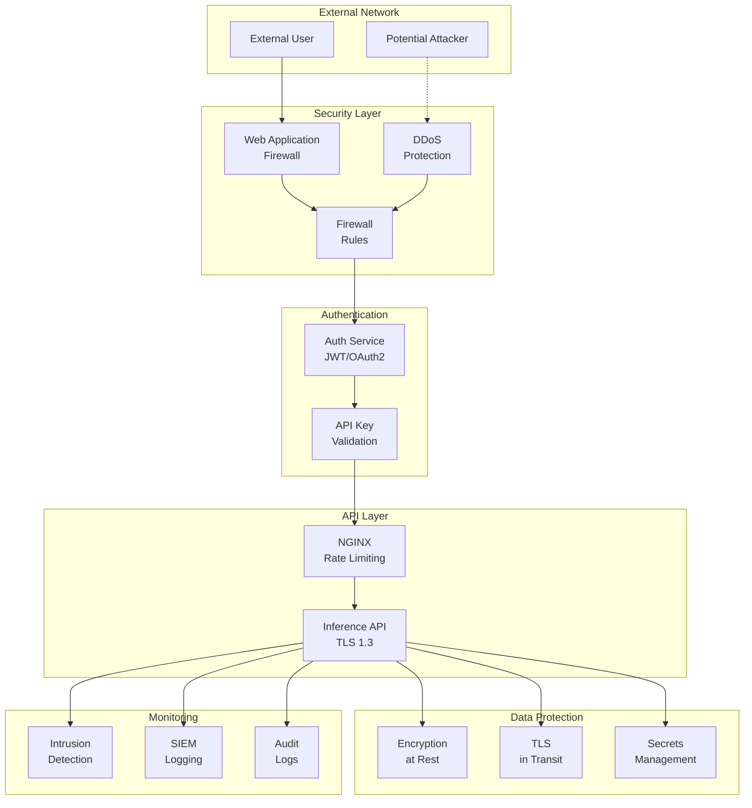

### Security Best Practices

1. **Authentication & Authorization**
   - JWT tokens with short expiry (15 min)
   - API key rotation every 90 days
   - Role-based access control (RBAC)
   - OAuth2 for third-party integrations

2. **Data Protection**
   - TLS 1.3 for all communications
   - AES-256 encryption at rest
   - PII data masking in logs
   - Secure model storage (encrypted S3)

3. **API Security**
   - Rate limiting: 100 req/min per IP
   - Input validation (Pydantic schemas)
   - SQL injection prevention
   - CORS policies configured

4. **Network Security**
   - Private VPC for services
   - Security groups with least privilege
   - WAF rules for common attacks
   - DDoS protection (CloudFlare/AWS Shield)

5. **Monitoring & Auditing**
   - All API calls logged
   - Anomaly detection on access patterns
   - Security event alerting
   - Compliance reporting (SOC2, GDPR)

---

## Deployment Architecture

### Production Deployment

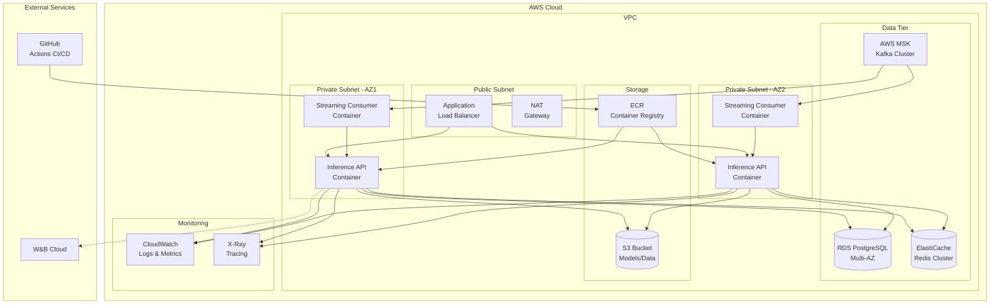

### CI/CD Pipeline

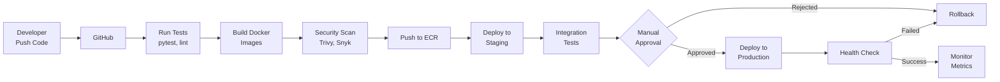

### Scaling Strategy

**Horizontal Scaling**:
```yaml
# Kubernetes HPA configuration
apiVersion: autoscaling/v2
kind: HorizontalPodAutoscaler
metadata:
  name: inference-api-hpa
spec:
  scaleTargetRef:
    apiVersion: apps/v1
    kind: Deployment
    name: inference-api
  minReplicas: 3
  maxReplicas: 10
  metrics:
  - type: Resource
    resource:
      name: cpu
      target:
        type: Utilization
        averageUtilization: 70
  - type: Resource
    resource:
      name: memory
      target:
        type: Utilization
        averageUtilization: 80
  - type: Pods
    pods:
      metric:
        name: http_requests_per_second
      target:
        type: AverageValue
        averageValue: "1000"
```

**Vertical Scaling**:
- CPU: 2-4 cores per instance
- Memory: 2-4GB per instance
- GPU: Optional for ANN inference (T4/V100)

---

## Appendices

### Appendix A: API Schema Reference

**NetworkFlowEvent Schema** (62 required fields):
```json
{
  "destination_port": "integer (0-65535)",
  "flow_duration": "float (>=0)",
  "total_fwd_packets": "float (>=0)",
  "total_backward_packets": "float (>=0)",
  "flow_bytes_s": "float",
  "flow_packets_s": "float",
  "flow_iat_mean": "float",
  "fwd_packet_length_mean": "float",
  "packet_length_mean": "float",
  "...": "... (53 more features)"
}
```

### Appendix B: Label Mapping

```python
LABEL_MAPPING = {
    'BENIGN': 0,
    'DoS Hulk': 1,
    'PortScan': 2,
    'DDoS': 3,
    'DoS GoldenEye': 4,
    'FTP-Patator': 5,
    'SSH-Patator': 6,
    'DoS slowloris': 7,
    'DoS Slowhttptest': 8,
    'Bot': 9,
    'Web Attack_Brute Force': 10,
    'Web Attack_XSS': 11,
    'Infiltration': 12,
    'Web Attack_Sql Injection': 13,
    'Heartbleed': 14
}
```

### Appendix C: Performance Tuning Checklist

**Training Phase**:
- [ ] Use stratified sampling for imbalanced data
- [ ] Apply SMOTE for minority classes
- [ ] Use class weights in loss function
- [ ] Implement early stopping
- [ ] Run hyperparameter tuning (RandomizedSearchCV)
- [ ] Perform 5-fold cross-validation
- [ ] Analyze learning curves
- [ ] Check for overfitting (train vs val gap)
- [ ] Calibrate probability outputs
- [ ] Log all experiments to W&B

**Validation Phase**:
- [ ] Evaluate on hold-out test set
- [ ] Calculate per-class metrics
- [ ] Generate confusion matrix
- [ ] Analyze false positives/negatives
- [ ] Check prediction calibration
- [ ] Measure inference latency
- [ ] Test with edge cases
- [ ] Validate on adversarial examples

**Deployment Phase**:
- [ ] Implement model versioning
- [ ] Set up A/B testing
- [ ] Configure auto-scaling
- [ ] Enable caching (Redis)
- [ ] Set up monitoring alerts
- [ ] Configure drift detection
- [ ] Implement graceful degradation
- [ ] Set up backup models
- [ ] Document API changes
- [ ] Create runbooks for incidents

### Appendix D: Troubleshooting Guide

| Issue | Symptoms | Solution |
|-------|----------|----------|
| Low accuracy on minority classes | F1 < 0.7 for some classes | Apply SMOTE, adjust class weights |
| High inference latency | p95 > 50ms | Use batching, model quantization |
| Model drift detected | PSI > 0.2 | Retrain with recent data |
| API timeout errors | 503/504 errors | Increase replicas, optimize code |
| Memory issues | OOM errors | Reduce batch size, optimize features |
| Data quality issues | Many 422 errors | Improve input validation |
| Cache misses | Hit rate < 70% | Adjust TTL, increase cache size |

### Appendix E: Quick Reference Commands

```bash
# Training
make train
python batch-trainer/train.py --data-path data/cicids2017.csv

# API Testing
make test-api-quick
make test-api-full

# Monitoring
curl http://localhost:8000/healthz
curl http://localhost:8000/metrics

# Docker
docker-compose up -d
docker-compose logs -f inference-api
docker-compose down

# Kubernetes
kubectl get pods
kubectl logs -f deployment/inference-api
kubectl scale deployment/inference-api --replicas=5
```

---

## Summary

This document provides a comprehensive architecture and design specification for the AI-CTIDS system, covering:

✅ **High-Level Design**: System architecture, component responsibilities
✅ **Low-Level Design**: Detailed implementation for each microservice
✅ **Sequence Diagrams**: Request flows, training pipeline, drift detection
✅ **Monitoring**: Prometheus metrics, Grafana dashboards
✅ **W&B Integration**: Experiment tracking, model comparison
✅ **Performance Optimization**: 10+ strategies to improve accuracy, speed
✅ **Security**: Authentication, encryption, compliance
✅ **Deployment**: AWS architecture, CI/CD, scaling
✅ **Troubleshooting**: Common issues and solutions

**Target Metrics**:
- Accuracy: >98%
- F1 Macro: >90%
- Latency (p95): <15ms
- Throughput: >2000 predictions/second
- Uptime: 99.9%

For questions or improvements, contact the AI-CTIDS team.

---

**Document Version**: 1.0
**Last Updated**: 2026-07-26
**Authors**: AI-CTIDS Engineering Team
**Status**: Production Ready
